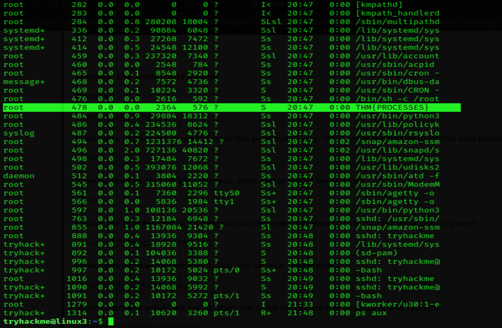
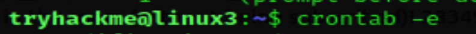
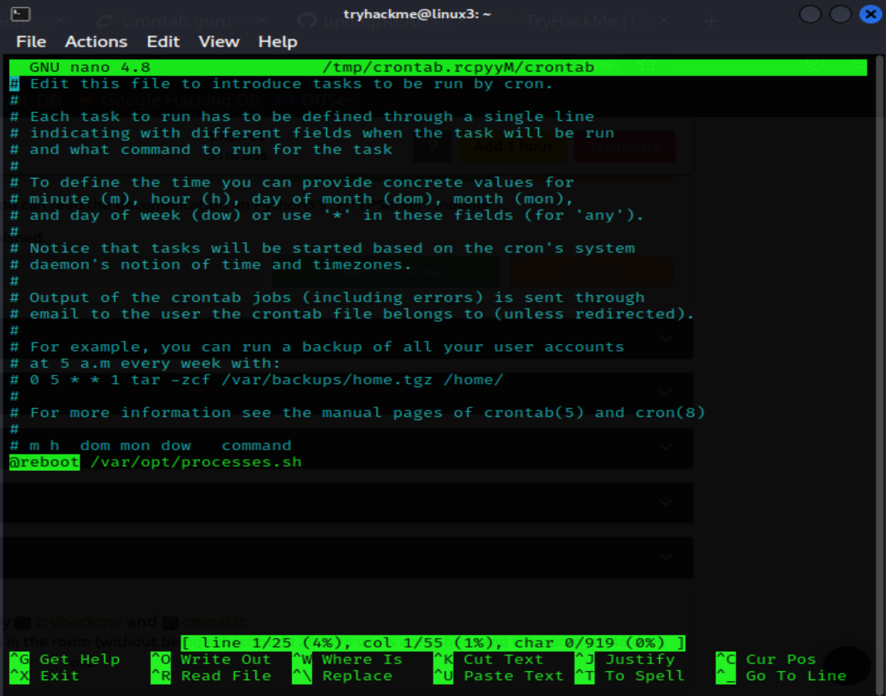
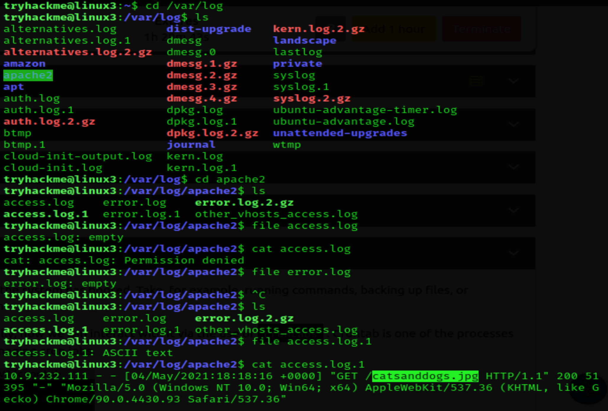

# THM Challenges
## Room 3
### Task 3

1- First question we need to create a file with nano command. we will suppose the name of the file as MoBakr.txt:
> nano MoBakr.txt

2- second we will open "task3" file with nano command to get the flag
> nano task3

so, the flag:
> THM{TEXT_EDITORS}

### Task 4
- To Remind

1- Now we wil solve this challenge:

Download the file http://10.10.127.47:8000/.flag.txt onto the TryHackMe AttackBox

What are the contents?

- We used the command "python3 -m http.server" to make a server to send information and take a response 
- Now we will use "wget" command to download ".flag.txt" from the HTTP link after this process we will find file ".flag.txt.1" we will use "cat" command to capture the flag.
> THM{WGET_WEBSERVER}

### Task 5
#### Now we will solve this challenges:

1- If we were to launch a process where the previous ID was "300", what would the ID of this new process be?
>301

2- If we wanted to cleanly kill a process, what signal would we send it?

> SIGTERM

3- Locate the process that is running on the deployed instance (10.10.127.47). What flag is given?

- by using "ps aux" command we will see all commands are running now 
we will see the flag is:

> THM{PROCESSES}

4- What command would we use to stop the service "myservice"?

- we will use command:
> systemctl stop myservice

5- What command would we use to start the same service on the boot-up of the system?

- we will use command:
> systemctl enable myservice

6- What command would we use to bring a previously backgrounded process back to the foreground?
- we will use command:
> fg

### Task 6
#### Now we will solve this challenges:

1- When will the crontab on the deployed instance (10.10.127.47) run?

- Now to get the time we will use the command:
> crontab -e

- we will find a file we can modifing it but if we looking in the last of it we will notice a line start with @reboot and that is our answer 
> @reboot

### Task 6
#### Now we will solve this challenges:

1- What is the IP address of the user who visited the site?

2- What file did they access?

- in this challenge we will use "cd" command to go to the directory "/var/log/apche2" and use "ls" comamnd we will find file "access.log.1" by using "cat" command we will find the IP and the file which they access